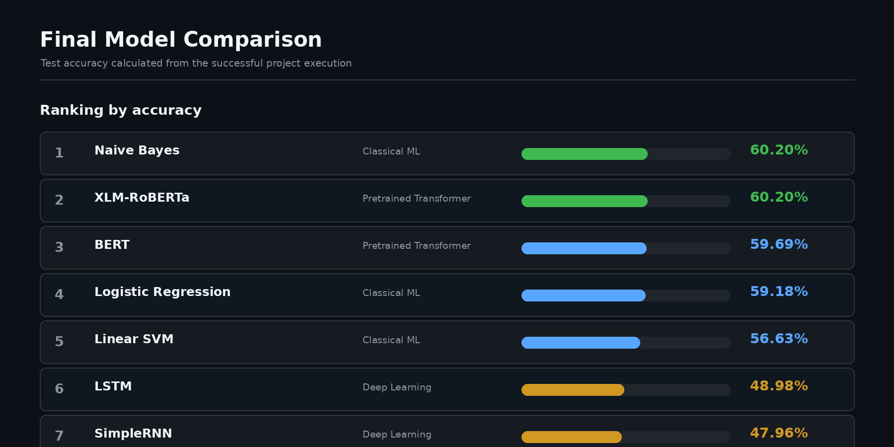
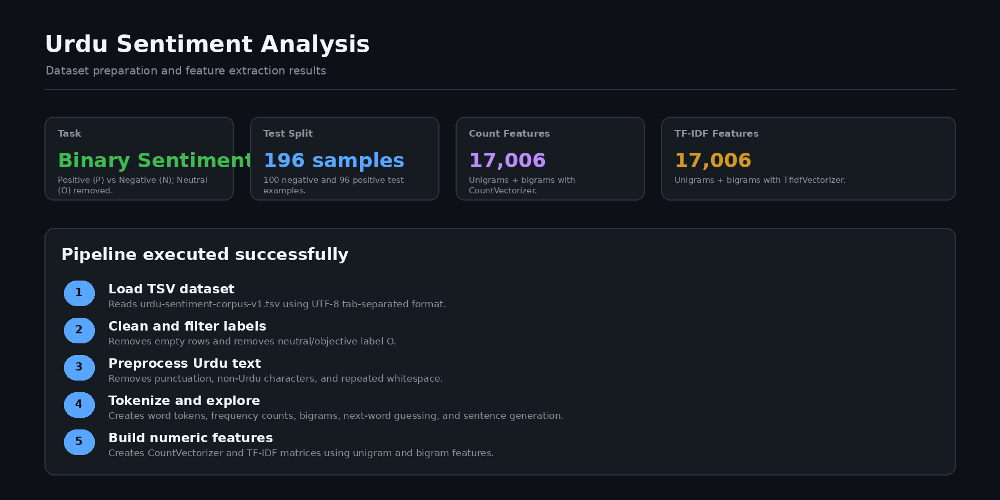
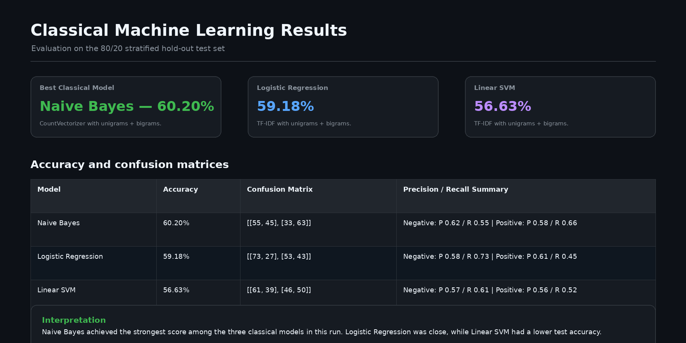
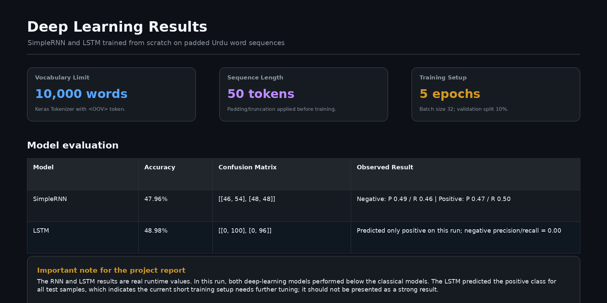
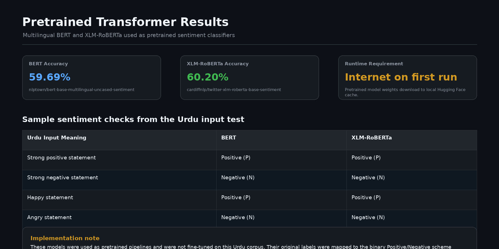

# Urdu Sentiment Analysis

A multi-model Natural Language Processing project for classifying Urdu text into **Positive (P)** and **Negative (N)** sentiment.

The project combines traditional Machine Learning, Deep Learning, and pretrained Transformer models. It also includes Urdu text preprocessing, word and bigram analysis, model comparison, and a Tkinter GUI for live prediction.

## Models Used

* **Machine Learning:** Multinomial Naive Bayes, Logistic Regression, Linear SVM
* **Deep Learning:** Simple RNN, LSTM
* **Transformers:** Multilingual BERT, XLM-RoBERTa

> Neutral (`O`) samples are removed to perform binary Positive/Negative classification. BERT and XLM-RoBERTa are used as pretrained sentiment models and are not fine-tuned on this dataset.

## Workflow

```text
Dataset → Text Preprocessing → Tokenization → Feature Extraction
→ Model Training & Evaluation → Model Comparison → Tkinter GUI Prediction
```

## Results

| Model               | Accuracy |
| ------------------- | -------: |
| Naive Bayes         |   60.20% |
| Logistic Regression |   59.18% |
| Linear SVM          |   56.63% |
| RNN                 |   47.96% |
| LSTM                |   48.98% |
| Multilingual BERT   |   59.69% |
| XLM-RoBERTa         |   60.20% |

**Best result in the current run:** Naive Bayes and XLM-RoBERTa achieved **60.20% accuracy**.

## Technologies

Python • Pandas • NumPy • Scikit-learn • TensorFlow / Keras • Hugging Face Transformers • PyTorch • Tkinter

## How to Run

```bash
pip install -r requirements.txt
python main.py
```

Make sure `urdu-sentiment-corpus-v1.tsv` is in the same folder as `main.py`.

## Project Structure

```text
urdu-sentiment-analysis/
├── main.py
├── requirements.txt
├── urdu-sentiment-corpus-v1.tsv
├── README.md
├── docs/
│   └── urdu-sentiment-analysis-project-report.pdf
└── result/
    ├── 01-dataset-and-feature-extraction.png
    ├── 02-classical-machine-learning-results.png
    ├── 03-deep-learning-results.png
    ├── 04-pretrained-transformer-results.png
    └── 05-final-model-comparison.png
```

## Screenshots

### Final Model Comparison



<details>
<summary><b>View complete evaluation results</b></summary>

<br>

### Dataset and Feature Extraction



### Classical Machine Learning Results



### Deep Learning Results



### Pretrained Transformer Results



</details>

## Documentation

[View Detailed Project Report](docs/urdu-sentiment-analysis-project-report.pdf)

## Author

**Sohaib Ali**
BS Artificial Intelligence Student
Email: [zebi65871@gmail.com](mailto:zebi65871@gmail.com)
